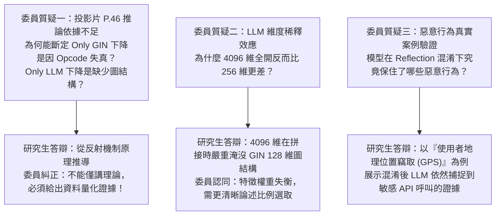

# 🎓 碩士論文口試審查攻防 Part 1：DRAVILaMA 實驗嚴謹度與特徵機制檢討

> **會議場次**：沈柏寧碩士學位口試（審查委員提問與答辯第 1 階段）  
> **受審研究生**：沈柏寧  
> **指導教授**：陳奕明博士  
> **攻防核心**：消融實驗（Ablation Study）因果推論之嚴謹度、特徵稀釋效應（Feature Dilution）、行為子圖提取依據、惡意程式真實案例檢驗  
> **關鍵結論**：口試委員高度肯定模型的抗混淆效果，但嚴肅指出「推論不可僅憑直覺」，要求論文修正中必須補齊特徵空間變異的直接數據證據。

---

## ⚔️ 口試委員核心質疑與攻防焦點

---

## 📌 審查核心議題深度解析

### 1. 投影片 P.46 的因果推論缺陷（委員最嚴厲要求）
* **委員問題**：
  > 「你在投影片 P.46 推論了兩點：第一，Only GIN 分數往下降是特徵分佈被改變；第二，Only LLM 是缺少其他特徵輸入。你怎麼證明是這個原因，而不是其他超參數或訓練雜訊導致的？你有直接數據證明特徵分佈失真嗎？」
* **答辯與修正**：
  * 研究生原本僅依據 Java 反射機制的理論概念進行推論，缺乏特徵空間直接統計量。
  * **委員指示修正方向**：
    1. 必須計算混淆前後節點特徵向量（Opcode / Permission）的 Cosine Distance 或 KL Divergence，直接拿出數據證明「圖特徵確實大幅漂移」。
    2. 論文寫作不可用「我們推論...」帶過，必須寫成「經實驗統計顯示，混淆後節點相似度下降 X%，故驗證了特徵失真」。

### 2. 特徵融合的維度平衡難題（256D vs 128D vs 4096D）
* **深入探討**：
  * 當 LLM 採用完整未壓縮的 4096 維 Embedding 與 GIN 的 128 維串接時，在混淆情境下的偵測率反而顯著下跌（跌至 89.6%）。
  * **原因剖析**：多層感知機（MLP）在接收 4224 維輸入時，梯度主要被 LLM 的龐大維度主導，GIN 辛苦萃取出的函式呼叫圖拓撲結構被完全「稀釋邊緣化」。
  * **結論**：壓縮至 256 維不僅大幅節省顯存與運算開銷，更能與 GIN 128 維達成 2:1 的黃金特徵平衡比。

### 3. 行為子圖 (BHS) 與實機惡意案例檢驗
* **實例展示**：
  * 審查過程中，研究生調出了一支實際竊取使用者地理資訊的惡意 APK 樣本。
  * 攻擊者利用 `Class.forName("android.location.LocationManager").getMethod("getLastKnownLocation")` 進行動態反射呼叫。
  * **傳統 GIN 盲點**：反編譯靜態分析時找不到與 `LocationManager` 的直接控制流連線，判定為普通良性程式。
  * **DRAVILaMA 成功捕獲原因**：CodeLlama 讀取到了上下文的常數字串 `"android.location.LocationManager"` 與周圍的變數處理邏輯，對比學習成功將該語意映射至敏感空間，挽救了漏報。

---

## 📝 指導教授與委員結論性指示
1. **補足量化指標**：不能只有最終的 Accuracy / F1，必須補充特徵層面的直接變化統計圖表。
2. **答辯心態調整**：指導教授陳奕明博士在場提醒研究生：「報告時要把眼神放在委員與投影幕上，不要只低頭看筆電自顧自唸，要明確展示你的研究信心與證據鏈。」
