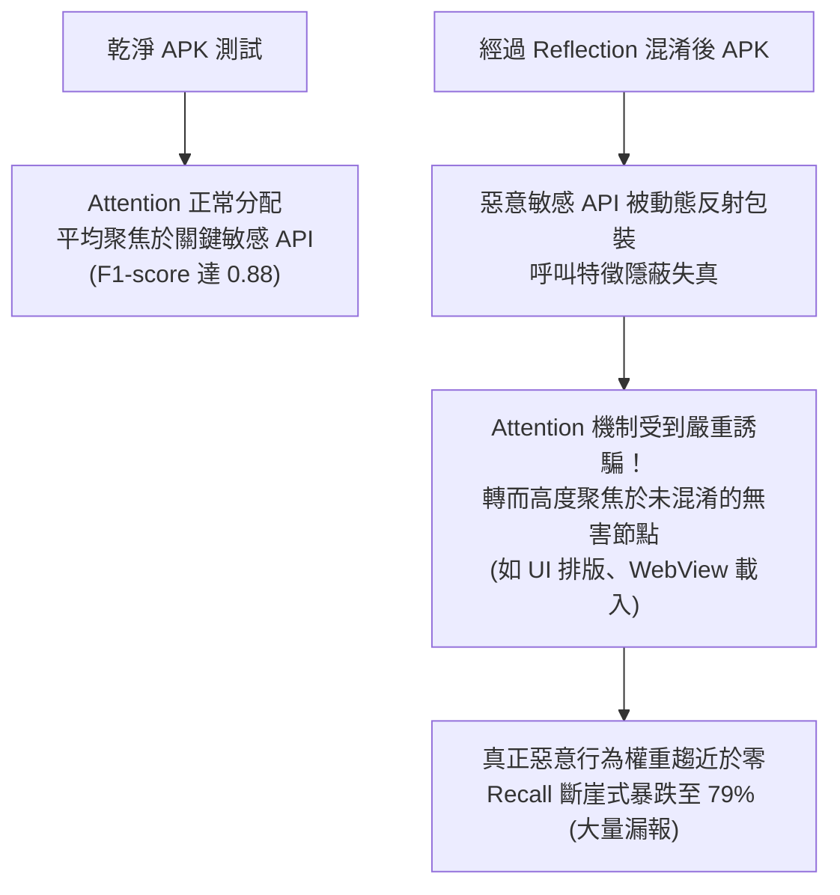

# 🎓 碩士論文口試審查攻防 Part 2：Attention Pooling 機制深層辯論與口試總結

> **會議場次**：沈柏寧碩士學位口試（審查委員提問與答辯第 2 階段 & 口試決議總結）  
> **受審研究生**：沈柏寧  
> **指導教授**：陳奕明博士  
> **攻防核心**：Attention Pooling 遭混淆誘騙之深層機理、注意力權重轉移視覺化要求、論文定稿修改清單、審查決議  
> **口試結果**：**口試通過！** 需依照委員要求完成論文關鍵證據鏈補強（限期內修改並經陳奕明博士覆核）。

---

## 🔬 核心攻防：為什麼 Attention Pooling 在混淆下會「致命崩潰」？

### 1. 委員與研究生的激烈辯論焦點
* **委員提問**：
  > 「你在投影片中主張『Attention 抓沒有被混淆的節點，反而導致惡意行為被忽視』。這個結論很反直覺，一般大家認為 Attention 機制動態賦權會比無腦 Mean 取平均更聰明，為什麼在你的混淆情境下會慘敗？」
* **答辯核心推導**：
  1. **反射混淆的特質**：工具只會對關鍵的敏感 API 進行反射呼叫，其他 90% 的普通程式碼（如 UI 佈局、按鈕監聽、WebView、字串格式化）根本不會去動。
  2. **注意力陷阱**：Attention 機制在訓練時試圖尋找特徵最穩定、模式最重複的子圖。當混淆發生時，只有那些無害的普通節點維持不變，Attention 模組便「誤以為」這些不變的節點是最具代表性的主特徵，賦予其極高權重；而真正藏有惡意行為的反射節點因模式改變，注意力權重被壓抑至谷底。
  3. **Mean Pooling 的穩健性**：Mean 取平均對所有節點一視同仁，不會盲目將權重傾斜給特定節點，反而守住了被混淆節點的基本訊號。

* **委員決議指示**：
  * 研究生必須在論文中補充**注意力權重分佈熱力圖（Attention Heatmap）**，明確標註出未混淆名單（UI / WebView 等等）在混淆前後權重暴增的實際數值，作為終極硬性證據。

---

## 📋 口試委員指定之論文修改清單 (Action Items)

| 序號 | 修改章節 | 修改要求與重點 |
| :---: | :--- | :--- |
| **1** | **第 3 章 方法論** | 補充行為子圖 (BHS) 擷取演算法之半徑 $k=2$ 敏感度分析，說明為何不選 $k=1$ 或 $k=3$。 |
| **2** | **第 4 章 實驗一** | 補上 Attention Pooling vs Mean Pooling 的注意力權重轉移熱力圖（證實無害節點權重暴增）。 |
| **3** | **第 4 章 實驗二** | 補齊特徵空間歐幾里得距離與 Cosine 相似度矩陣，提供特徵稀釋效應的數學證明。 |
| **4** | **第 4 章 討論** | 深入剖析 AML 混淆工具之 Wrapper 函式機制，解釋為何隨機命名包裝函式會破壞 GIN 葉節點。 |
| **5** | **格式與排版** | 統整專有名詞縮寫（BHS, NT-Xent, GIN），校對圖表引用序號。 |

---

## 🏆 口試最終結果與側記
1. **口試成績**：全體口試委員一致同意**審查通過**，高度認可 DRAVILaMA 在抗混淆資安實務上的創新突破與工程完整度。
2. **會後叮嚀**：指導教授陳奕明博士與委員在口試結束後溫馨提醒研究生：「這幾天連續熬夜辛苦了，回去第一件事先好好大睡一覺，星期四再回研究室進行論文最終修訂與茶點禮儀覆核。」
