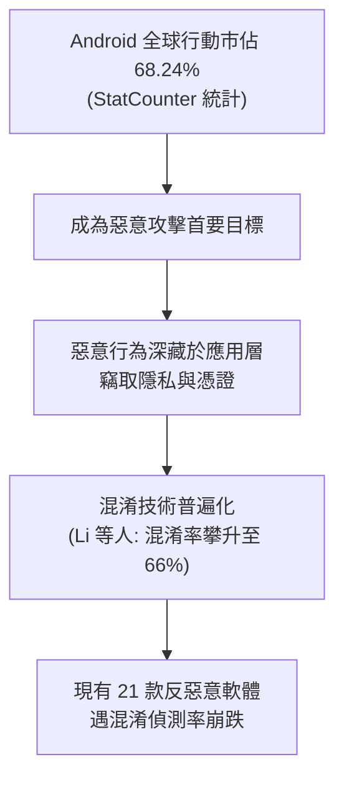
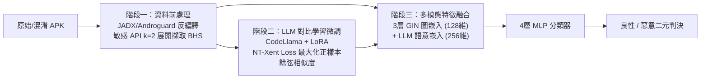

# 🛡️ 碩士論文口試精華整理：DRAVILaMA Android 惡意程式抗混淆偵測

> **論文主題**：DRAVILaMA：以對比學習圍繞大型程式語言模型並結合圖結構特徵以提升安卓惡意程式偵測與抗混淆能力  
> **研究生**：沈柏寧（資安研究所碩士候選人）  
> **指導教授**：陳奕明博士  
> **核心技術**：CodeLlama (LLM)、LoRA 參數高效微調、NT-Xent 對比學習、GIN (圖同構網路)、Mean Pooling、反射混淆 (Reflection Obfuscation) 韌性  
> **研究成果**：在嚴苛的 Java Reflection 混淆下，F1-Score 達到 **92.7% ~ 97.9%**，超越基準方法約 4%~10%，大幅降低資安維運漏報率。

---

## 🎯 研究背景與產業痛點

### 1. 傳統偵測機制的致命缺陷
1. **API 序列方法（如 MaMaDroid）**：
   - 依賴敏感 API 轉移機率。當攻擊者使用 **Java Reflection (`getMethod()`, `invoke()`)** 動態呼叫時，呼叫關係被徹底打斷，靜態分析直接失效。
2. **圖神經網路方法（GNN / 如 MalScan, MS-Droid）**：
   - 將函式視為節點，依賴 Opcode、Permission 與 API 呼叫構建行為圖。Reflection 導致圖節點與控制流嚴重失真。
3. **單純大型語言模型（LLM）方法**：
   - 遇 Renaming / Reflection / 敏感字串陣列混淆時，LLM 語意理解力大幅下滑，缺乏全域程式碼結構感知。

---

## 🔬 DRAVILaMA 核心方法論與三階段架構

### 階段一：資料前處理與行為子圖 (BHS) 擷取
* **工具**：Androguard、JADX。
* **敏感權限映射**：參考 PScout 與 Axplorer 權限對應表，精準定位調用敏感 API 的關鍵函式。
* **行為子圖 (Behavior Subgraph, BHS)**：以敏感函式為中心，向上向下展開 2 層 ($k=2$)，擷取呼叫關係。一支 APK 切割為多個獨立的 BHS。

### 階段二：CodeLlama 對比學習 (Contrastive Learning)
* **Token 嵌入與聚合**：Java Source Code 經 CodeLlama 提取最後一層 Hidden State，透過 **Mean Pooling** 聚合為 BHS 向量。
* **APK 級對比映射**：將同一 APK 的所有 BHS 向量投影聚合為單一 APK-level Embedding。
* **NT-Xent Loss 損失設計**：
  $$\mathcal{L}_{\text{NT-Xent}} = -\log \frac{\exp(\text{sim}(z_i, z_j) / \tau)}{\sum_{k=1}^{2N} \mathbb{I}_{[k \neq i]} \exp(\text{sim}(z_i, z_k) / \tau)}$$
  * **正樣本對**：同一個 APK 在混淆前與混淆後的 Embedding。
  * **負樣本對**：Batch 內所有其他不同的 APK。
  * **效果**：強制模型將混淆前後的同源程式碼在特徵空間中強烈拉近，縮短語意距離。
* **LoRA 微調**：凍結 CodeLlama 主幹權重，僅微調低秩矩陣，大幅節省 GPU 算力。

### 階段三：多模態特徵融合與分類
* **圖同構網路 (GIN)**：3 層 GIN，輸入節點 Opcode/Permission，輸出圖結構向量 $H_{BHS}$（128 維）。
* **語意嵌入**：CodeLlama 提取之語意向量（256 維）。
* **特徵拼接**：$128\text{D} + 256\text{D} = 384\text{D}$ 混合向量，輸入 4 層 MLP 進行最終惡意分類。

---

## 📊 關鍵實驗數據與重要結論

### 1. 聚合策略對比：為什麼選 Mean Pooling 而非 Attention Pooling？
* **現象**：在乾淨資料集上兩者 F1 相當 (~0.88)；但在**混淆資料集**上，Attention Pooling 的 Recall 暴跌至 **79%**，而 Mean Pooling 維持穩定高水準。
* **原因分析**：
  * Attention 機制被帶偏，自動聚焦在「被 Reflection 混淆刻意避開」的無害 UI/WebView 程式碼上，忽視了被混淆的真正惡意呼叫。
  * Mean Pooling 保持無偏權重，能有效兼顧全貌。

### 2. 消融實驗 (Ablation Study)

| 模型配置 | 乾淨資料集 F1 | 混淆資料集 F1 | 核心發現 |
| :--- | :---: | :---: | :--- |
| **Only GIN** | 96.8% | 88.23% | Opcode 與 Permission 在混淆後特徵分佈失真嚴重 |
| **Only LLM** | 96.5% | 88.95% | 缺乏全域圖結構資訊，單一語意特徵抗性有限 |
| **No Contrastive (未對比學習)** | 97.1% | 90.70% | LLM 面對反射字串與動態呼叫仍會受到語意干擾 |
| **DRAVILaMA (完整模型)** | **97.9%** | **92.72% ~ 97.92%** | **多模態融合 + 對比學習，混淆情境下表現全數最高** |

* **空間距離量化**：對比學習使混淆前後同 APK 的歐幾里得距離從 `0.1536` 縮小至 `0.0824`（**縮小 46.3%**），t-SNE 視覺化呈現高度聚類重疊。

### 3. 未知混淆工具泛化能力（面對 AML 工具）
* 傳統 MS-Droid 面對 AML（隨機命名 Wrapper 包裝函式）時，Recall 崩跌至 **0.19%**（幾乎完全失效，因節點結構被 Wrapper 破壞）。
* **DRAVILaMA** 憑藉 LLM 留存的程式碼語意脈絡，在未曾見過的混淆工具下依然保有高強度的惡意辨識能力。
