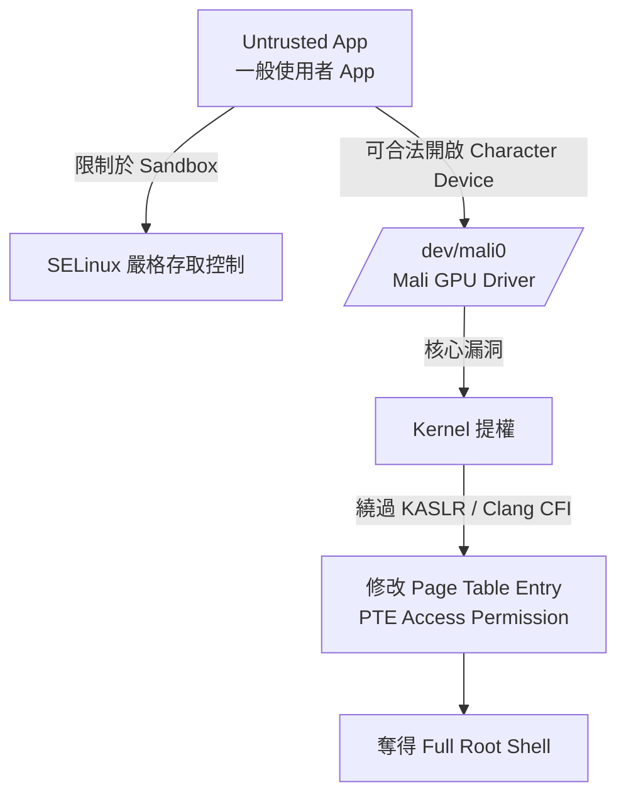
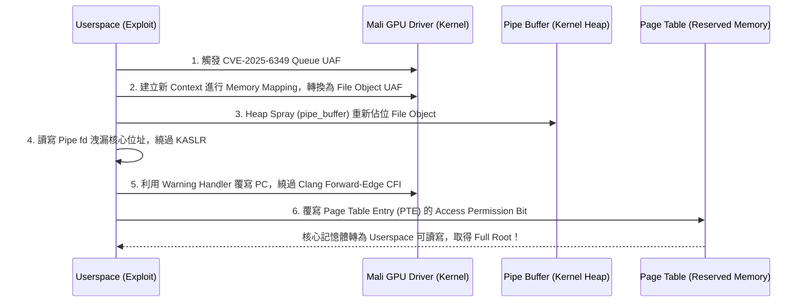

# 📱 91 Google Pixel 8A Mali GPU Driver 漏洞挖掘與提權實戰 (PK)

> **演講主題**：從 Untrusted App 到 Full Root：Pixel 8A ARM Mali GPU Driver Exploit 實戰剖析  
> **講者**：PK（資安研究員，專注於 System 與 Browser 安全）  
> **目標機型**：Google Pixel 8A (Android 14 / ARM64 / ARM Mali GPU)  
> **達成效果**：一般權限 App 背景執行 Exploit，繞過 KASLR、SELinux、Clang CFI，奪得 Full Root 權限。

---

## 🎯 攻擊情境與防禦體系分析

### 1. Android 沙箱與攻擊面收斂
* **SELinux 大掌櫃**：Android 透過嚴格的 SELinux 規則，極大程度限縮了 Untrusted App 的 System Call 與 IPC 權限。
* **第三方硬體驅動成破口**：
  * Untrusted App 為了進行圖形渲染，SELinux 必須開放存取 `/dev/mali0`（GPU Character Device）。
  * 手機廠商（如 Google Pixel、Samsung）整合晶片商的第三方硬體驅動程式，程式碼複雜度高且品質難以完全把關，成為核心漏洞最主要的來源。

---

## 🔬 除錯與漏洞挖掘環境建立

在實機手機上除錯 Android Kernel 極其困難（缺乏實體硬體 Debugger、重開機慢），講者採用了巧妙的除錯策略：

1. **`CONFIG_MALI_BIFROST_NO_MALI`**：
   * ARM Mali 驅動提供的特殊編譯選項，可在**無實體硬體**的情況下將驅動編譯至 Local VM (QEMU / Linux)。
   * Backend 自動對硬體操作進行 Dummy Mock，維持 95% 以上的驅動邏輯正常運作。
2. **實機輔助除錯方案**：
   * **kprobes**：Hook 核心關鍵函式，在被呼叫時印出 Argument 參數與 Return Value。
   * **自製記憶體讀取 Helper**：指定核心虛擬位址即時 Dump 資料，用於驗證 Heap Spray 佔位狀態，免去反覆編譯燒錄核心的痛苦。

---

## 💥 核心漏洞深度剖析

### 漏洞一：CVE-2025-8045（kbase_kcpu_queue Double Free）
* **成因**：
  * 在 `kbase_kcpu_queue`（處理 CPU Side 非同步任務隊列）中，提供註冊 Dump Buffer 以供錯誤處理時輸出除錯資訊。
  * **Race Condition**：Thread 1 送出 Command 觸發 Timeout 錯誤，Worker 等待 Dump Buffer 註冊；Thread 2 同時執行註冊 Dump Buffer 操作。
  * 由於缺乏適當的同步互斥鎖，狀態機發生混亂。下次重新註冊時仍沿用先前的 Buffer 位址，反覆觸發釋放，形成穩定的 **Double Free**。

### 漏洞二：CVE-2025-6349（kbase_context Queue Object UAF - 0-Day）
* **發現過程**：講者在複現 Project Zero 公布的 1-Day 漏洞時，微調 `mmap` 映射大小參數（由 `0x3000` 改為異常值），意外觸發驅動內部 WARNING，進而逆向挖出全新的 0-Day。
* **成因**：
  * `kbase_csf_queue` 由核心結構 `kbase_context` 的 Linked List 管理。
  * 當 Userspace 呼叫 `mmap` 傳入不合法 Size 時，映射失敗；`mmap` 錯誤處理常式錯誤遞減了 Queue 的 Reference Count，使其歸零並立即釋放（Free）。
  * 但 `kbase_context` 中的 Linked List **仍保留懸空指標（Dangling Pointer）**，形成典型的 **Use-After-Free (UAF)**。

---

## 🧩 Exploit 構造與防禦機制繞過

### 1. Primitive 轉換（Queue UAF $\rightarrow$ File Object UAF）
* Queue 內部成員 `kctx` 在操作時會被連續解引用（Dereference）兩次，直接利用極易引發 Kernel Crash。
* 構造流程：建立第二個 Context 佔位 Queue $\rightarrow$ 建立 `kbase_va_region` 映射物件增加 Refcount $\rightarrow$ 由第一個 Context 觸發 UAF 釋放，成功轉換為穩定的 `file` 物件 UAF。

### 2. Heap Spray 佔位與 KASLR 繞過
* 使用 `pipe_buffer`（Pipe Page）進行核心 Heap Spray 重新佔位釋放的 File Object。
* 在 Userspace 透過讀寫 Pipe 檔案描述子，精確控制核心結構內容並讀取核心指標，洩漏位址以計算 KASLR Slide。

### 3. 繞過 Clang Forward-Edge CFI
* **問題**：Android 在 ARM64 核心全面啟用 Clang CFI，在呼叫函式指標前會嚴格檢查 4-byte Type Signature，指標被竄改會直接執行 `BRK` 指令導致 Kernel Panic。
* **繞過技巧**：
  * 利用核心既有的 **Warning Handler** 機制。
  * Warning Handler 在處理完畢後會主動更新 PC 暫存器（跳過產生警告的指令），利用此特性劫持控制流跳過 CFI 檢查，成功執行目標核心函式。

### 4. Page Table 覆寫提權（Full Root）
* ARM64 Page Table 中，第二與第三層 Page Table 由開機時的 Reserved Memory Allocator 配置。
* 開機雜訊小的情況下，Page Table 落在固定預測位址的機率高達 **95%**。
* 攻擊者直接覆寫 Page Table Entry (PTE) 的 Access Permission Bit，將 Kernel Text & Data 映射至 Userspace 可讀寫，寫入 Root 憑證並關閉 SELinux，取得 Full Root Shell。

---

## 💡 關鍵總結與啟示

1. **晶片商驅動是端點安全的軟肋**：即便 Android 核心與 SELinux 不斷強化，第三方驅動程式碼量龐大且更新節奏落後，依然是提權攻擊的主戰場。
2. **複現 1-Day 是挖掘 0-Day 的絕佳途徑**：在深入分析修補代碼與邊界條件時，經常能發現周邊邏輯的關聯漏洞。
3. **CFI 防禦並非堅不可摧**：防禦機制本身的例外處理流程（如 Warning/Break Handler）可能成為繞過管制的跳板。
