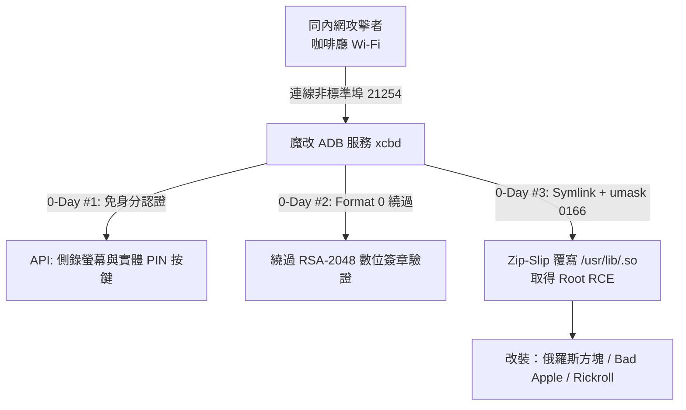

# 💳 92 POS 刷卡機魔改 ADB 與 AI 輔助挖 0-Day 實戰

> **演講主題**：從咖啡廳刷卡機到壞蘋果：AI 輔助逆向挖掘 3 個 0-Day 漏洞並達成 Root RCE  
> **目標設備**：市售主流嵌入式 Linux POS 刷卡機  
> **核心亮點**：揭露魔改 ADB 服務、打造「永不放棄（Never Giving Up）」AI 逆向框架、挖出 3 個 0-Day、驅動隱藏硬體晶片（播放 Bad Apple 與 Rickroll）。

---

## 🔍 POS 刷卡機架構與魔改 ADB 服務（xcbd）

### 1. 魔改 ADB（xcbd）分析
* POS 機在非標準 Port 開啟了魔改自 Android ADB 的後台服務（命名為 `xcbd`）。
* **安全機制閹割**：標準 ADB 在連線時需進行 `CNXN` 與 `AUTH` 金鑰雙向驗證，但廠商直接將金鑰驗證邏輯拔除，允許內網任意設備免認證直接連線。
* **執行檔防護**：系統所有安裝與執行程序均受 **RSA-2048 數位簽章** 限制，且封鎖了直接呼叫 `adb shell`。

---

## 🤖 AI 逆向挖洞困境與「永不放棄」壓榨框架

### 1. 傳統 LLM 逆向的致命缺點
* **太早放棄**：當 AI 遇到 RSA 簽章或命令報錯時，容易判定「技術上不可能」並要求人類切換目標。
* **卡在命令輸出**：終端畫面卡住時，AI 嘗試輸入 `clear` 失敗後便停止前進。

### 2. 解決方案：OpenClaw + Claude 微壓榨框架
* **工作流串接**：將 Claude API 與逆向輔助工具 OpenClaw 深度整合。
* **「Never Giving Up」迴圈**：
  * 當 AI 判定放棄時，自動切換視角、更換分析模組並強制繼續下達挖掘指令。
  * 實行「24 小時不休息」全自動逆向，在凌晨 0 點 12 分成功產出 RCE 攻擊鏈。

---

## 💥 3 個 0-Day 漏洞深度拆解

| 漏洞編號 | 漏洞類型 | 觸發位置 / 弱點特徵 | 攻擊影響與利用成果 |
| :--- | :--- | :--- | :--- |
| **0-Day #1** | **免認證 API 資訊洩漏** | `SCREEN_KEY` & `FRAMEBUFFER` API | 連線同 Wi-Fi 即可即時 Dump 實體按鍵 PIN 碼並截圖螢幕，直接側錄信用卡交易。 |
| **0-Day #2** | **數位簽章驗證邏輯繞過** | 安裝模組格式代碼檢查（Format Code 0） | 若安裝包**純包含 `.so` 動態函式庫**（無執行檔），格式代碼回傳 0，驗證常式直接判定合法，徹底繞過 RSA-2048。 |
| **0-Day #3** | **Zip-Slip 任意檔案覆寫 RCE** | 解壓縮模組 `umask 0166` 且 `open()` 遺漏 `O_NOFOLLOW` | 構造帶有 Symlink 的惡意安裝包（<100KB），覆寫 `/usr/lib/` 系統常駐行程引用的 `.so`，背景載入立即觸發 **Root RCE**。 |

---

## 🎮 刷卡機改裝大作戰：極限硬體壓榨

在取得 Root 權限後，講者與 AI 合作對刷卡機進行了多項極限挑戰：

1. **俄羅斯方塊**：將 POS 機彩色液晶螢幕改裝為掌上遊戲機。
2. **Bad Apple 串流播放（500MB $\rightarrow$ 5MB）**：
   * 刷卡機儲存空間僅剩 300MB，無法放入 500MB 影片。
   * AI 提出 **1-bit 差分壓縮演算法**，將每一影格壓至 1-bit 二值化資料，整部影片壓縮至 5MB，在低配 CPU 上以 30 FPS 流暢播放。
3. **自寫音訊驅動 Rickroll**：
   * 逆向主機板電路，發現一顆未掛載驅動的音訊晶片 **AK4951**。
   * 由 AI 直接編寫驅動程式操控暫存器播放聲音，成功讓刷卡機喇叭大聲播放《Never Gonna Give You Up》。

---

## 📢 漏洞通報現實困境與防護建議

### 1. 廠商通報荒謬歷程
* **推拖過期**：「該設備已上市 8 年，現已不維護，不發布安全性公告。」
* **卸責經銷商**：「請聯繫您的終端經銷商（但根本找不到經銷商）。」
* **拖延修復**：告知即將公開揭露後，廠商改口要求時間修復，但預估修復期竟然為「可能明年」。

### 2. 給消費者與商家的防護建議
* **VLAN 內網隔離**：店家必須落實網路分流，絕不可將 POS 刷卡機與顧客公共 Wi-Fi 置於同一網段。
* **優先使用行動支付**：Apple Pay / Google Pay 使用一次性虛擬 Token 交易，即使刷卡機遭到側錄也無法取得真實信用卡號。
