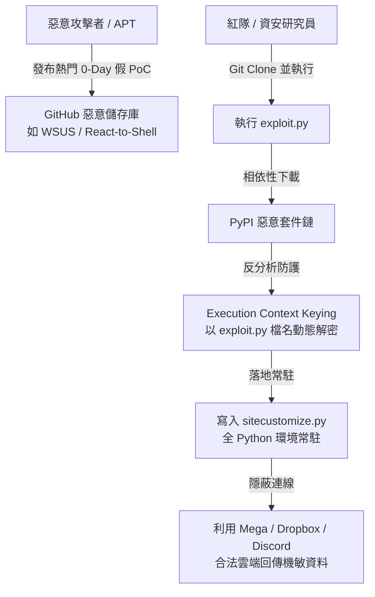
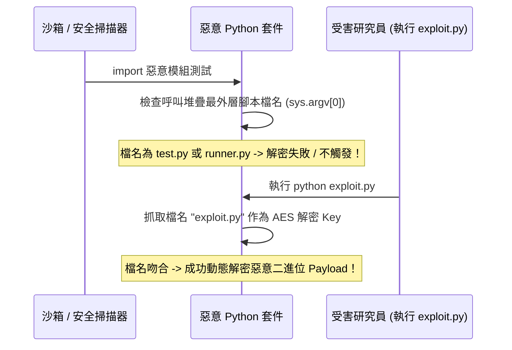

# ⚔️ 93 黑吃黑：瞄準資安研究員與紅隊的供應鏈攻擊 (Jason & Sam)

> **演講主題**：黑客瞄準駭客：偽造 PoC 與 PyPI 惡意供應鏈攻擊深度分析  
> **講者**：Jason & Sam（Vulnerability Intelligence Research Team）  
> **核心亮點**：GitHub 假 PoC 釣魚陷阱、PyPI 74 萬套件檔尾極速過濾技術、Execution Context Keying 動態反分析解密、UTC+8 與農曆新年停工威脅情資。

---

## 🎯 威脅全景：針對紅隊與研究員的「黑吃黑」攻擊

### 1. 攻擊情境與動機
* 攻擊者不再廣撒網攻擊一般民眾，而是鎖定**資安研究員、紅隊滲透測試員與企業內部資安人員**。
* **高價值目標**：資安人員的電腦中常存放大量未公開漏洞資料、客戶網路權限、API Key 與滲透工具憑證。

---

## 🎣 假 PoC 傳播與 PyPI 多層依賴鏈

1. **熱門漏洞關鍵字釣魚**：
   * 鎖定微軟重大漏洞（如 WSUS 漏洞）或新興架構漏洞（如 React-to-Shell），在 GitHub 迅速上架包含假 PoC 的 Repo。
2. **多層 PyPI 相依性包裝**：
   * PoC 腳本中引用看似無害的相依套件，該套件再引入下一層 Native Package，將惡意 Payload 隱藏於深度依賴鏈中。

---

## ⚡ 74 萬 PyPI 套件極速分析技術

如何在大規模 PyPI 套件中迅速找出隱藏惡意 Native Library 的套件？

* **傳統作法盲點**：下載所有 74 萬個套件解壓分析需數十 TB 頻寬與數週時間。
* **ZIP 檔尾目錄（Central Directory）過濾法**：
  * Python Wheel 套件為標準 ZIP 格式，其**檔案目錄結構全部記錄在檔案最後的 Central Directory**。
  * 利用 HTTP Range Request **只下載套件最後數 KB 的檔尾資料**，即可在幾毫秒內得知套件內是否包含 `.so`、`.dll`、`.dylib` 等二進位檔案。
  * 迅速將 74 萬套件過濾收斂至 **22,000 個**，其中含 Native Library 者僅約 **11,000 個**，大幅提升威脅狩獵效率。

---

## 🔐 高級反分析技術：Execution Context Keying

攻擊者如何確保惡意 Payload 只有在被研究員執行時才會觸發，而不會被沙箱與自動化掃描器抓到？

* **原理**：惡意模組執行時不存放固定解密金鑰，而是透過 `inspect.stack()` 動態取得呼叫端最外層的檔案名稱（如 `exploit.py`），以此檔名字串作為 AES 解密 Key。
* **效果**：沙箱若以通用名稱（如 `sample.py`）載入套件，解密會完全失敗並報錯退出，完美規避自動化檢測。

---

## ☁️ C2 通訊與 Persistence 常駐維持

1. **合法雲端服務混淆（Living off Trusted Services）**：
   * 不自建容易被封鎖的 C2 伺服器，改用 **Mega.nz、Dropbox API、Discord Webhook** 進行指令接收與憑證回傳，流量完全混入正常企業 HTTPS 流量。
2. **`sitecustomize.py` 全域常駐**：
   * 將惡意 Hook 代碼寫入 Python 的 `sitecustomize.py`。
   * 只要系統上任何地方啟動 Python 行程（包含使用 pip、執行分析腳本），惡意邏輯都會在 Python 直譯器初始化時第一時間自動執行。

---

## 🕵️ APT 威脅情報分析

* **作息時區**：攻擊者更新程式庫與連線活躍時間高度集中於 **UTC+8 時區週一至週五（10:52 ~ 19:23）**。
* **節慶特徵**：在**農曆除夕至初五**期間，所有惡意專案更新與 C2 伺服器完全停工，展現強烈的東亞文化特徵。
* **受害者畫像**：在蜜罐（Honeypot）分析中，攻擊者在植入後台後特別點開閱讀受害者電腦中的**中文保密協定（NDA）與半導體 28/16 奈米製程技術分享報告**，顯示具備高度產業針對性。

---

## 🛡️ 研究員自我防護檢核清單

- [ ] **絕不在實體 Host 執行網路上的 PoC 腳本**，必須在一次性 Docker 或隔離 VM 中執行。
- [ ] 執行前檢查 `requirements.txt` 與相依性，留意來源可疑的 PyPI 套件名稱。
- [ ] 定期檢查 Python 環境目錄下的 `sitecustomize.py` 與 `usercustomize.py` 是否遭異常竄改。
- [ ] 限制測試環境的外網連線能力，防止雲端 API 憑證外洩。
