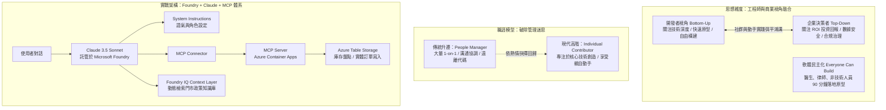

# 💡 125 AI 時代下的軟體民主化、工程師定位對談與 Claude MCP 實戰工作坊

> **活動形式**：Panel 對談（思想碰撞） + Hands-on Lab（實戰工作坊）  
> **主持人**：Justin（資深軟體工程師、AI 社群推手）  
> **對談嘉賓**：  
> * **Jun**（Anthropic Japan Developer Community 負責人，前 Sony PS3、Google、Roblox 工程專家）  
> * **Ash**（微軟 Commercial / GTM 策略主管，前投資銀行股票分析師）  
> * **Amanda**（Anthropic 舊金山總部工程師，工作坊主講）  
> **關鍵技術**：Anthropic Claude 3.5 Sonnet / Opus, Model Context Protocol (MCP), Microsoft Foundry, Foundry IQ, Azure Container Apps, Individual Contributor (IC) 職涯模型  
> **核心價值**：探討 AI 時代軟體民主化下的個人工程師定位、破除「經理人迷思」回歸 IC 創造力、釐清企業與開發者的視角落差，並以 Claude + MCP 實作具備工具調用與業務落地的點餐 Agent。

---

## 🎯 核心概念：軟體民主化、角色演進與 Agentic 落地架構

---

## 🔬 對談思想精華與關鍵技術剖析

### 1. 職涯抉擇：破除「升主管才是成功」的迷思
* **Jun 的深刻體悟**：曾身為 Sony、Google、Roblox 的管理階層，卻發現每天排滿的 1-on-1 會談耗盡熱情。他主動選擇回到 Anthropic 擔任 **Individual Contributor（IC）**，親手參與技術構建。工程師應正視內心熱情，技術深耕的 IC 同樣具備無可替代的崇高價值。
* **人機共存哲學**：AI 不會消滅工程師，而是將生產力推高 10 倍。當基礎編程自動化後，人類在**宏觀架構設計、跨領域系統整合、商業判斷與同理心溝通**上的能力變得前所未有地重要。

### 2. 視角融通：Top-Down 商業決策 vs. Bottom-Up 創新
* **軟體民主化（Democratization of Software）**：AI 賦能非技術人員（加州律師、診所醫師、輪椅族群）在 90 分鐘內解決傳統軟體開發無法覆蓋的長尾痛點。
* **企業導入成熟度變遷**：
  * **2024 年以前**：盲目追求成為「AI-First 公司」（FOMO 心理）。
  * **2026 年現狀**：聚焦「解決何種量化業務痛點？」、Tokenomics 成本治理、以及以 Anthropic Safety 為代表的負責任 AI 與隱私保護。

### 3. 個人與生活效率躍升實證
* **Ash 的時間審計（Time Audit）**：利用 Claude 分析兩年行事曆與通訊，重構工作流，每週常態化省下 **13 至 17 小時**（相當於每週額外獲得 1.5 天工作時間）。
* **長輩數位賦能**：65 歲以上非技術長輩透過自然語言對話獨立完成票務與生活資訊查詢，抹平數位鴻溝。

---

### 4. Hands-on Lab：Claude 3.5 Sonnet + MCP 點餐 Agent 架構實作

在工作坊實作中，Anthropic 與微軟展示了完整的 Agentic 落地鏈條：

1. **模型階層選型（Model Sizing）**：
   * 破除「無腦選最大旗艦模型」的誤區：生產環境任務首選平衡型主力 **Claude 3.5 Sonnet**，兼具頂級 Tool Use 推理與低延遲成本優勢。
2. **MCP（Model Context Protocol）驅動的外部 Tool 整合**：
   * Agent 不再是封閉聊天機器人，透過標準 MCP 連接器呼叫託管於 Azure Container Apps 的 MCP Server。
   * 實現結構化輸出（Structured Outputs），精準呼叫 `create_customer`、`check_inventory`、`place_order` API，將點餐紀錄實時寫入 Azure Table Storage。
3. **Foundry IQ 知識中繼層**：
   * 將店家規範、食材過敏原說明等非結構化政策置於外部知識庫，由 Foundry IQ 動態擷取，避免 Prompt 臃腫並確保回答一致性。
4. **現場 O2O 閉環體驗**：
   * 與會者在虛擬終端完成 Agent 訂購，系統核銷 Voucher 後，現場即刻領取實體杯子蛋糕，完成完美的 O2O（Online-to-Offline）實踐。

---

## 💡 關鍵總結與啟示

1. **保持熱情，擁抱初心**：無論技術如何演進，對技術的熱愛與創造力是工程師永不褪色的核心競爭力；勇於追求 IC 路線，親自動手能帶來最大的成就感。
2. **商業視角與技術能力同等重要**：優秀的工程師不僅懂得調用 Claude 與 MCP，更能站在 C-Level 與客戶視角評估安全、合規與商業 ROI。
3. **社群是跨越未知的加速器**：在 AI 瞬息萬變的時代，任何人都是初學者；積極融入在地開發者社群（如台灣 AI 社群），透過同儕案例互助學習，是保持前沿地位的關鍵路徑。
