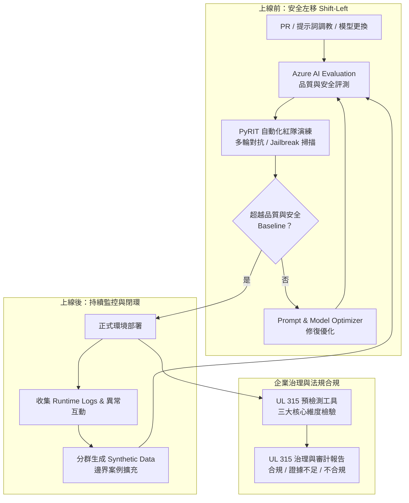

# 🛡️ 121 AI 系統生命週期評測、紅隊演練與 UL 315 責任 AI 治理標準

> **演講主題**：從 CI/CD 自動化評測、PyRIT 紅隊對抗到 UL 315 國際合規落地實踐  
> **講者**：微軟架構團隊、Fend（微軟負責任 AI 團隊）、先 / Sean（新說資訊）  
> **關鍵技術**：Azure AI Evaluation, PyRIT, Shift-Left Red Teaming, SAG Control Specification, UL 315 預檢測工具, EU AI Act 對齊  
> **核心價值**：建立 AI 生命週期評測閉環，將紅隊對抗左移至開發與 QA 階段，透過 UL 315 預檢測工具實現跨國法規合規與信任落地。

---

## 🎯 核心概念：AI 生命週期治理與評測架構

---

## 🔬 技術細節與實施重點

### 1. AI 評測指標體系與 CI/CD 整合
* **品質 vs. 安全維度**：
  * **品質（Quality）**：回答準確性、相關性、格式正確度與檢索完整性。
  * **安全（Safety）**：有害內容抑制、越獄防禦、敏感資訊保護。
  * **實務關鍵指標**：**任務偏移（Task Drift）**（偏離預定業務軌道）與**行為規範違規（Policy Violation）**（違反企業道德或條款）。
* **CI/CD 自動阻斷門檻**：PR 變更時自動觸發數十至數百個 Evaluator，評分未達 Baseline 則禁止 Merge 至生產環境。
* **分群取樣（Clustering Sampling）**：避免測試集偏誤，透過分群演算法確保測試案例均勻覆蓋各類業務情境。

### 2. PyRIT 自動化紅隊演練（Red Teaming）
* **微軟開源工具 PyRIT**：Python Risk Identification Toolkit for Generative AI。
* **多輪攻擊策略（Multi-Turn Attack）**：
  * **角色扮演與情感勒索**：經典「阿嬤念序號」越獄話術。
  * **編碼與結構混淆**：利用字詞倒置、字元反向、Base64 或自訂密碼混淆繞過表面字詞過濾。
* **量化指標（Risk Score）**：以結構化報告輸出攻擊成功率，Risk Score 為 0.0 代表防禦體系完美攔截所有攻擊手法。

### 3. 四層防禦架構與 SAG Control Specification
* **AI 應用防禦四層**：
  1. **基礎模型層（Model Layer）**：原廠模型微調、安全對齊（Alignment）與有害輸出抑制。
  2. **系統層（System Layer）**：Agent 協調層、MCP Server 安全邊界、Tool 權限控管。
  3. **應用層（Application Layer）**：Prompt 模板防護、輸入/輸出過濾器（Content Filters）。
  4. **營運層（Operations Layer）**：Runtime 監控與日誌審計。
* **SAG Control Specification**：將歐盟《人工智慧法案》（EU AI Act）、美國 NIST AI RMF、ISO 42001 標準的治理控制項規格化，嵌入 Agent 執行中繼層。

### 4. UL 315 AI 產品安全評估標準與預檢測工具
* **國際標準地位**：全球首個全面性 AI 產品安全標準，正被提案採納為美加國家標準。
* **12 項原則與三大核心問答**：
  * **技術層面**：做的是否正確？（系統穩定性、魯棒性、風險管理）。
  * **倫理層面**：是否會傷害人？（演算法公平性、無偏見、隱私資料保護）。
  * **治理層面**：是否有負責人？（合規文件齊備度、稽核軌跡、問責機制）。
* **Clearview AI 反面案例**：未經同意抓取公開人臉照片建立比對庫，引發人臉誤識逮捕與人權侵害，面臨全球重罰，突顯上線前評估之急迫性。
* **預檢測工具判定特點**：
  * 獨立輪次評估，消除舊結論干擾。
  * 支援「證據不足（Insufficient Evidence）」彈性判定，避免武斷誤判。

---

## 💡 關鍵總結與落地啟示

1. **評測必須左移（Shift-Left）**：評測與紅隊攻擊不能等上線才做，應內嵌於 PR 與 CI/CD 流程中作為發布閘門。
2. **閉環優化（Continuous Loop）**：上線後的異常與邊界案例必須轉化為 Synthetic Data，持續回流推高 Baseline。
3. **治理架構不可缺席**：面對歐盟與美加日益嚴格的法規要求，採用對齊 UL 315 的標準化工具是企業防範合規巨災的最佳解方。
