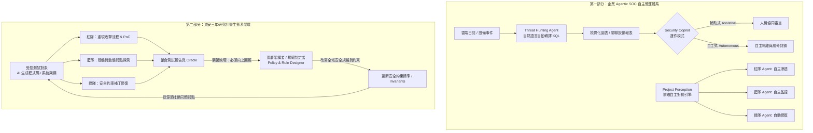

# 🛡️ 124 Agentic SOC 企業 AI Agent 安全營運中心與資安研究計畫閉環治理對談

> **演講主題**：Agentic SOC 自主安全營運架構、Project Perception 自主對抗，以及資安三年研究計畫（紅藍綠體系）之閉環生態治理實務  
> **演講者**：微軟雲端安全架構師  
> **交流對話者**：Youchen（資安三年研究計畫研究員）、現場資深資安架構前輩  
> **關鍵技術**：Microsoft Security Copilot, Defender XDR, Threat Hunting Agent (Natural Language to KQL), Sentinel MCP Server, Project Perception (Autonomous Red/Blue/Green Agent Loop), Closed-Loop Governance (閉環治理)  
> **核心洞察**：
> 1. 企業 SOC 演進：從 Assistive（人機協同）邁向 Autonomous（自主狩獵與處置），藉由自動化 KQL 與 MCP 整合達成 6.5 倍威脅檢出率。
> 2. 資安研究計畫校準：紅藍綠三隊分工（紅隊重建攻擊、藍隊弱點偵測、綠隊修復驗證）不能只停留在修復代碼，必須將驗證結論回饋至頂層架構師（Policy Designer），建立如健保署跨院互通般的生態系治理閉環。

---

## 🎯 核心架構：雙重防護與研究治理閉環

---

## 🔬 技術細節與對話深度剖析

### 1. Security Copilot 模式演進與自然語言 KQL 狩獵
* **雙重模式演進**：
  * **輔助式（Assistive）**：Copilot 作為分析師助手，輔助摘要事件、解釋惡意指令碼與提供處置建議。
  * **自主式（Autonomous）**：Agent 在設定權限內，自主展開深度關聯調查、拉取日誌並執行遏制行動，實測能將惡意威脅檢出率提升 **6.5 倍**。
* **Threat Hunting Agent**：
  * 徹底解決資安人員必須記憶艱澀 **KQL（Kusto Query Language）** 語法的痛點。
  * 分析師以自然語言輸入（如「盤點近 30 天內與 PowerShell 攻擊相關的所有設備」），Agent 自動轉譯生成語法完全合規的 KQL，即時繪製統計趨勢圖並匯出調查清冊。
* **Sentinel MCP Server 官方整合**：包含 Data Exploration、Copilot Agent Creation 與 Triage Agent，並支援企業自建 API 介面串聯內部 CMDB。

### 2. Project Perception：高頻自主紅藍綠對抗
* **解決傳統痛點**：年度滲透測試與紅隊演練成本極高、頻率過低（一年一次），無法跟隨每週爆發的 0-Day 與新攻擊手法。
* **持續自主對戰**：當有新 CVE 或新威脅情報出現時，紅隊 Agent 自動針對內部資產展開模擬打靶，藍隊 Agent 實時偵測，綠隊 Agent 驗證補丁有效性，實現「常態化實戰自檢」。

---

### 3. 會後深談：資安三年研究計畫的關鍵診斷（閉環治理）

在會後 Youchen 與資安前輩的對談中，針對當前進行的「資安三年研究計畫（sec-poc / SUT 測試地基）」提出了重磅的架構建言：

* **當前研究分工**：
  * **紅隊**：重建攻擊流程、構造利用鏈與驗證 PoC。
  * **藍隊**：程式碼靜態審計、AI 生成程式碼弱點檢測。
  * **綠隊**：弱點修復與後端安全約束驗證。
* **前輩指出的致命缺環——「缺少向上閉環」**：
  * **問題癥結**：目前研究僅停留在「發現弱點 $
ightarrow$ 綠隊修補代碼」的局部補破網，未將驗證結論回流至系統設計層。
  * **機場安檢與健保署系統的經典類比**：
    * 發生 911 事件後，改寫安檢規則的是管理機場航安的**頂層架構單位**，而不是現場執勤人員。
    * 健保系統若各家醫院各搞一套，資料不互通就是「孤島」；只有中央健保署統一定義數據標準，才能實現全國跨院病歷互通。
  * **落地解方**：
    1. 紅藍綠三隊的驗證結果，必須制度化**向上回報給頂層架構師／設計者（Policy Designer）**。
    2. 由架構師依據報告**改寫根本規格與安全約束（Security Invariants）**，使新一代代碼生成或架構從源頭就具備免疫力。
    3. 避免三人三隊變成各自為政的獨立孤島，必須依托統一平台（如受控 SUT 標竿測試庫）協同匯流。

---

## 💡 關鍵總結與啟示

1. **從自動化走向自主化**：現代 SOC 透過自然語言驅動 KQL 與 MCP 整合，讓 AI 擔當前線狩獵主角，大幅壓降反應時間。
2. **安全演練常態化**：借鑑 Project Perception 概念，以 Agentic 紅藍綠自主對抗替代低頻率的人工年度演練。
3. **無閉環，不治理**：資安研究與企業防禦絕不能滿足於「修復代碼」，唯有將實證漏洞向上轉化為「架構規則與安全約束」，才能真正打造具有自愈能力的資安免疫生態系。
