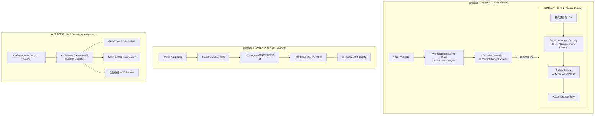

# 🛡️ 123 GitHub Advanced Security 聯防、MAGENTA 多 Agent 弱點審計與 AI Gateway 治理 (周祈和)

> **演講主題**：從 Code 到 Cloud：GHAS + Defender 雲地聯防、MAGENTA 多 Agent 弱點自動挖掘與 MCP / AI Gateway 治理  
> **講者**：周祈和（微軟 AI 解決方案工程師）  
> **關鍵技術**：GitHub Advanced Security (Secret/Dependency/Code Scanning), Copilot Autofix, Defender for Cloud (Attack Path / Security Campaign), MAGENTA (100+ Agent Harness), Model Context Protocol (MCP) Security, AI Gateway (Azure APIM), Defender XDR  
> **核心突破**：打破 Dev 與 SecOps 壁壘，以 Security Campaign 聯防；利用 100+ Agent 框架 MAGENTA 實現 96.5% 歷史漏洞檢出並自動生成 PoC 驗證；透過 APIM AI Gateway 治理企業級 MCP 流量。

---

## 🎯 核心概念：端到端 DevSecOps 與 AI 治理全景

---

## 🔬 技術細節深度剖析

### 1. GitHub Advanced Security (GHAS) 與自動化修復
* **Secret Scanning（金鑰防護）**：
  * **雙軌偵測**：傳統 Regex Pattern 比對 + AI 語意上下文辨識。
  * **廠商聯防撤銷**：偵測到金鑰外洩時，自動通知雲端廠商（如 AWS、Azure）即時撤銷（Revoke）。
  * **Push Protection**：在開發者 `git push` 當下立即擋下，避免金鑰進入 commit history。
* **Dependency Scanning（開源相依性審計）**：自動比對 Advisory Database，防範惡意套件與供應鏈攻擊。
* **Code Scanning (CodeQL) & Copilot Autofix**：靜態分析語法樹，精準標記弱點並直接提供修補建議代碼，實現「AI 發現、AI 修復」。
* **開源生態免費政策**：GHAS 對 GitHub 上所有 Open Source 專案全面開放免費使用。

### 2. DevSecOps 雲地串聯：Defender for Cloud 與 Security Campaign
* **消弭團隊摩擦**：開發者要敏捷，SecOps 要安全。透過系統串聯落實「Design with Security by Default」。
* **Attack Path Analysis（攻擊路徑分析）**：
  * 分析真實暴露風險：例如「對外開放的 Webshop 容器 $
ightarrow$ 橫向移動至儲存體 $
ightarrow$ SSN 敏感資料外洩」。
* **Security Campaign 智能篩選**：
  * SecOps 從 114 個待處理漏洞中，利用 Runtime Risk 篩選器（Internet-exposed + Attack Path）精準收斂至最致命的 9 個。
  * 在 Defender 介面內直接生成 GitHub Issue 並綁定至關聯 Repository，開發者可批次透過 Copilot Autofix 完成修復。

### 3. MAGENTA：100+ 多模型自主弱點挖掘與 PoC 驗證框架
* **核心理念（Agent Harness）**：防守與審計不再依賴單一模型或單一 Prompt，而是整合超過 100 個專精 Agent。
* **四階段挖掘流程**：
  1. **全域威脅建模**：掃描跨專案代碼與架構依賴。
  2. **多視角探測**：100+ Agent 跨不同模型並發審計。
  3. **模型對抗辯論（Debate）**：相互質疑與交叉比對，消除單一模型偏見與偽陽性。
  4. **PoC 實證驗證（Exploitability Proof）**：自動編寫可執行的攻擊腳本驗證弱點真實可利用性。
* **驗證成效**：歷史案例實測提升 96.5% 基準檢測率，121 個漏洞 100% 檢出。

### 4. MCP Security 與 AI Gateway (Azure APIM)
* **MCP（Model Context Protocol）三大安全邊界**：
  * 嚴格限制本機 Client 連向未授權外部 Server，防範惡意指令注入與隱私洩漏。
  * 本地個人環境與企業共享環境之分級授權。
  * 防範自建 MCP Server 成為缺乏審計的內網穿透跳板。
* **AI Gateway（Azure API Management）賦能**：
  * 企業既有 API 服務「一鍵發布」為標準 MCP Server。
  * 集中化身分認證（OAuth / Managed Identity）、Audit Log、並發防護與 Rate Limiting。
  * **FinOps 治理**：監控 Token 流量與即時成本分攤（Chargeback）。

### 5. Defender XDR 實戰案例：AI 訂房助理防護閉環
* **攻擊手法**：攻擊者透過 Prompt Injection 突破對話邊界，冒充管理員索取用戶信用卡資料。
* **閉環處置**：
  * 提示詞防護模組即時攔截惡意對話。
  * Defender XDR 串聯 VM 暴露、憑證竊取與越獄行為形成完整攻擊鏈。
  * 聯動修補：切換受控識別碼（Managed Identity）、停用共用 Key、落實最小權限資料存取控制。

---

## 💡 關鍵總結與啟示

1. **以 AI 治 AI**：面對代碼量與漏洞爆發，單純靠人工審查已不可行；透過 GHAS Copilot Autofix 與 MAGENTA 多 Agent 辯論驗證，才能在效率與安全間取得平衡。
2. **Runtime 脈絡引導修補優先級**：漏洞數量繁多，利用 Defender for Cloud 的攻擊路徑分析篩選出「真實暴露於網際網路且能觸及核心資料」的項目優先處理。
3. **MCP 治理需提前布局**：隨著 Agent 普及，MCP 通訊將成為企業核心資產與主要攻擊面，及早導入 AI Gateway 實施集中式身分、審計與 Token 控管至關重要。
