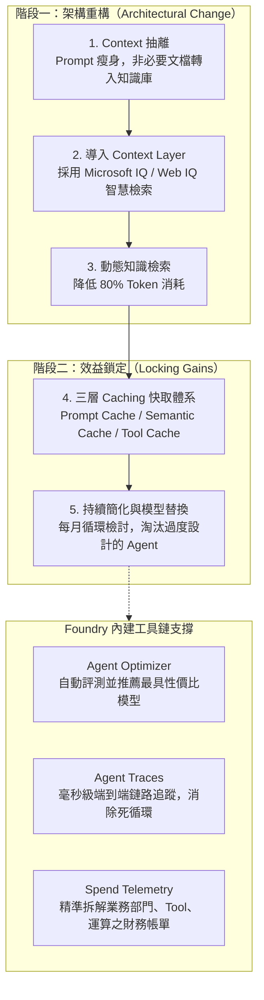

# 💰 122 Tokenomics: Driving Cost & Outcome Efficiency with Microsoft Foundry (Ash)

> **演講主題**：代幣經濟學（Tokenomics）：透過架構改造、三層快取與 Microsoft Foundry 工具鏈實現百萬級成本節省  
> **講者**：Ash（微軟 Commercial / Go-to-Market 策略主管，前投資銀行股票研究分析師）  
> **關鍵技術**：Context Layer (Microsoft IQ / M365 Profiler), Three-Tier Caching (Prompt/Semantic/Tool Caching), Agent Optimizer, Agent Traces, Spend Telemetry, Small Language Models (Phi-4)  
> **標竿案例**：美國電信龍頭 AT&T 月處理 7,000 億 Tokens，以微軟輕量模型 Phi-4 取代大型 Frontier 模型，年節省超過 1,000 萬美元。

---

## 🎯 核心概念：五步 Tokenomics 成本與效益優化架構

---

## 🔬 技術細節與三大快取機制

### 1. Context 治理：Prompt 與 Knowledge Base 的分界
* **常見架構反模式**：許多企業開發者直接將 40 頁的法規或產品手冊全文塞入 Prompt，造成巨額且無效的 Token 開銷。
* **正確做法**：將靜態文檔索引化置於 Knowledge Base，透過 **Microsoft IQ（如 Web IQ、M365 Profiler）** 建立中繼 Context Layer，由 Agent 視需求動態檢索，直接降低 **80% 的 Token 支出**。

### 2. 三層 Caching 快取機制（Three-Tier Caching）
* **LLM Caching 原理**：不同於傳統資料庫快取，LLM 快取是針對 Prefill 階段的 KV Cache 複用。
* **Prompt 結構化法則**：**靜態前綴（Static Content）在前，動態使用者輸入（Dynamic Content）在後**。若請求重複率大於 50%，快取效益立竿見影。
* **快取層級**：
  1. **Prompt Caching**：快取系統提示詞（System Prompts）與 Tool/Function Calling 的 JSON Schema。立即節省 20% ~ 30% 費用與顯著降低 TTFT（Time to First Token）。
  2. **Semantic Caching**：比對語意向量相似度，高相似查詢直接返回既有結果，免去重複推論。
  3. **Tool Result Caching**：對高成本外部 API 或資料庫查詢進行結果快取。

### 3. Microsoft Foundry 關鍵觀測與調校工具
* **Agent Optimizer（Public Preview）**：
  * 自動將企業的 Prompts、Models 與 Tools 放在評測指標（Evaluators）下進行基準測試。
  * 數據驅動推薦：明確指出特定任務使用小模型（SLM）即可達標，無需配置昂貴的大型模型。
* **Agent Traces（分散式追蹤）**：
  * 精確記錄 Agent 的每一次 Tool 調用、外部資料檢索、重試次數與延遲。
  * 迅速定位死循環（Infinite Loops）與架構瓶頸。
* **Spend Telemetry（FinOps 成本洞察）**：
  * 解決企業 AI 落地時財務與技術團隊的溝通斷層。
  * 精細化呈現各部門、各專案、正式/測試環境、Tool 調用與模型幻覺重試的精確花費。

---

## 🏢 企業標竿實例：AT&T 節省逾千萬美元

* **業務背景**：美國電信巨頭 AT&T 在 Microsoft Foundry 上每月推論處理量高達 **7,000 億 Tokens（700 Billion Tokens/month）**。
* **優化策略**：透過 Foundry 的 Evaluator 與 Model Router 分析發現，大量日常高頻任務根本不需要昂貴的 Frontier 大模型。
* **實施成果**：
  * 策略性改用微軟輕量高能模型 **Phi-4**。
  * **單一專案累計節省超過 1,000 萬美元**，且各項業務 KPI 達成率絲毫未減。

---

## 💡 關鍵總結與啟示

1. **架構先於模型**：降低成本的第一步不是找更便宜的 API，而是重構 Context 架構，善用 Context Layer 避免盲目 Prompt 灌水。
2. **靜前動後，全面開 Cache**：靜態提示在前、動態在後，開啟 Prompt Caching 是當天即可落地並直接減碳節省 20-30% 的必備手段。
3. **Make Every Token Count**：*「不要只是計算花費了多少 Tokens，而是要讓花費的每一枚 Token 都產生最大商業價值。」*
