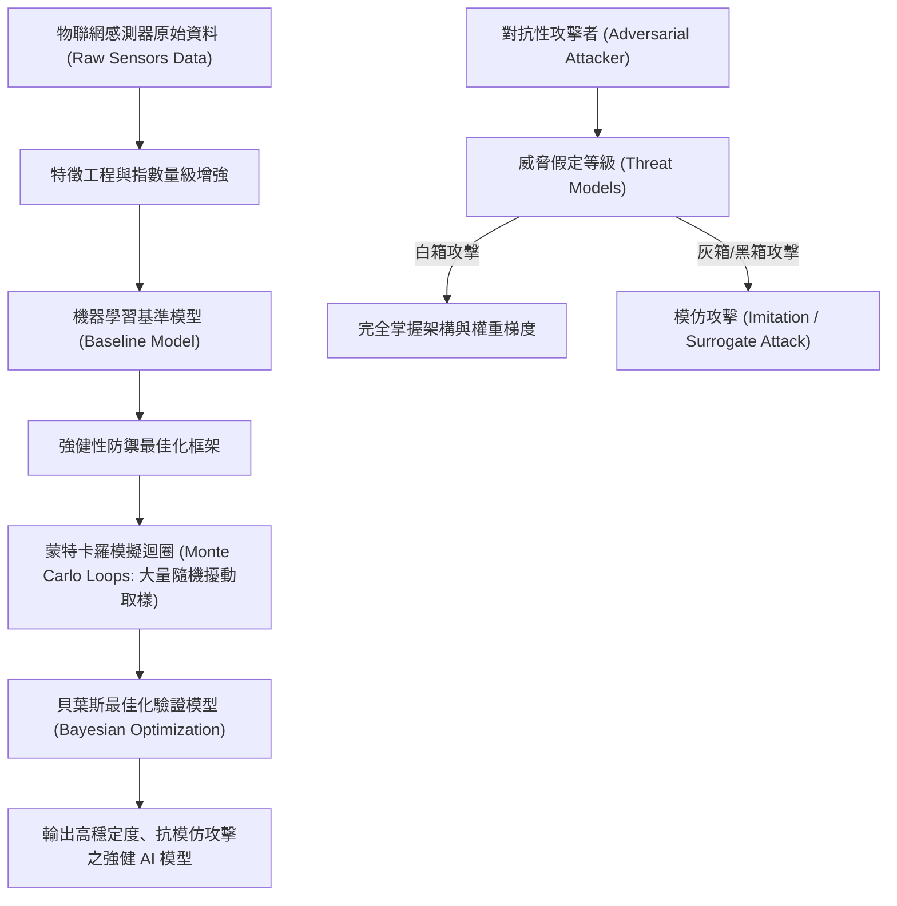

# 🛡️ 20260226-01 實驗室專案會議：對抗性模仿學習（AdMIL）與感測器模型黑白箱防禦

> **研討主題**：對抗性模仿學習（AdMIL）架構、物聯網感測器模型與黑箱／白箱威脅防禦  
> **主講與對談**：國際研究學員、指導教授、王教授、楊威教授  
> **所屬場合**：實驗室專案進度與學術研討會  
> **關聯文件**：[📄 完整原話逐字稿 (20260226-01-對抗性模仿學習與感測器模型防禦.full.md)](./20260226-01-對抗性模仿學習與感測器模型防禦.full.md)

---

## 🏛️ 核心架構與概念流轉圖

---

## 🔑 重點提要 (Key Takeaways)

1. **不能盲目依賴黑箱防禦假設**：現實攻防中，攻擊者可藉由查詢輸出訓練代理模型（Surrogate Model）實施高效的遷移性模仿攻擊，模型必須在數學架構上具備內生抗性。
2. **蒙特卡羅與貝葉斯聯手**：透過 Monte Carlo 迴圈生成海量擾動樣本，搭配貝葉斯機率架構動態調整模型超參數，能在有限算力下找到抵禦攻擊之全局最優防護解。
3. **多位教授指導要點**：強調實驗設計必須明確定義威脅模型假設邊界，防止因過度簡化黑箱條件而高估模型之實際強健性。
