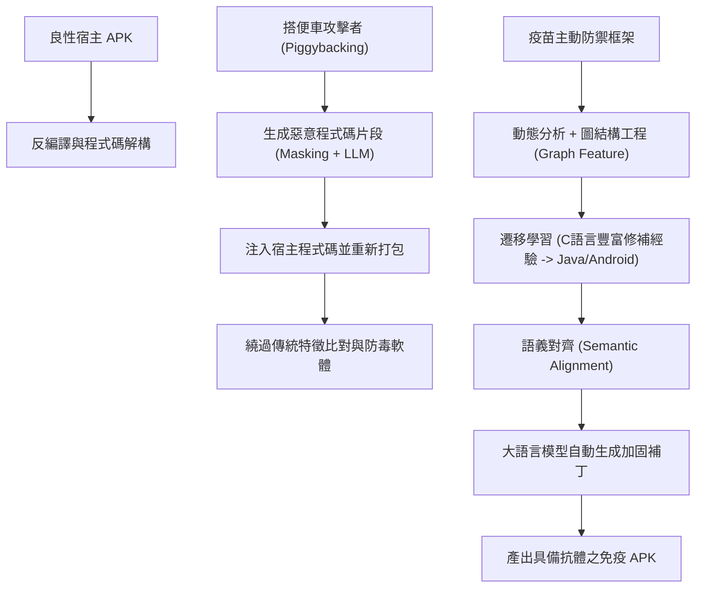

# 🛡️ 20260226-02 實驗室專案會議：APK搭便車攻擊防禦、免疫疫苗機制與程式碼自動修補

> **研討主題**：Android APK 搭便車攻擊（Piggybacking）、疫苗防禦機制、遷移學習程式碼自動修補與紅藍隊演練  
> **主講與對談**：發表研究生（Youchen）、指導教授（梁主任）、王教授、楊威教授  
> **所屬場合**：實驗室專案進度與學術研討會  
> **關聯文件**：[📄 完整原話逐字稿 (20260226-02-APK免疫疫苗與程式碼自動修補.full.md)](./20260226-02-APK免疫疫苗與程式碼自動修補.full.md)

---

## 🏛️ 核心架構與概念流轉圖

---

## 🔑 重點提要 (Key Takeaways)

1. **Piggybacking 攻擊的本質與破口**：攻擊者解開良性 APK 後僅注入少數惡意程式行並重新簽名，傳統靜態偵測與 Hash 驗證在特定分發場景下容易失效。
2. **疫苗與程式碼自動修補創新**：結合圖神經結構工程提取跨家族惡意特徵，並運用遷移學習將 C/C++ 巨量漏洞修復經驗遷移至 Android Java 生態，自動補強 APK 防禦圍牆。
3. **指導教授核心評語與修正方向**：
   - **問題定義收斂**：楊威老師與王老師指出，報告必須精確定義「為何傳統 Hash Code 或基礎防火牆無法防禦 Piggybacking」，釐清技術假設與限制條件。
   - **避免概念發散**：避免同時堆疊過多龐大術語，應將核心故事線聚焦於「語言模型語義對齊與自動程式碼補強」的實質可行性。
