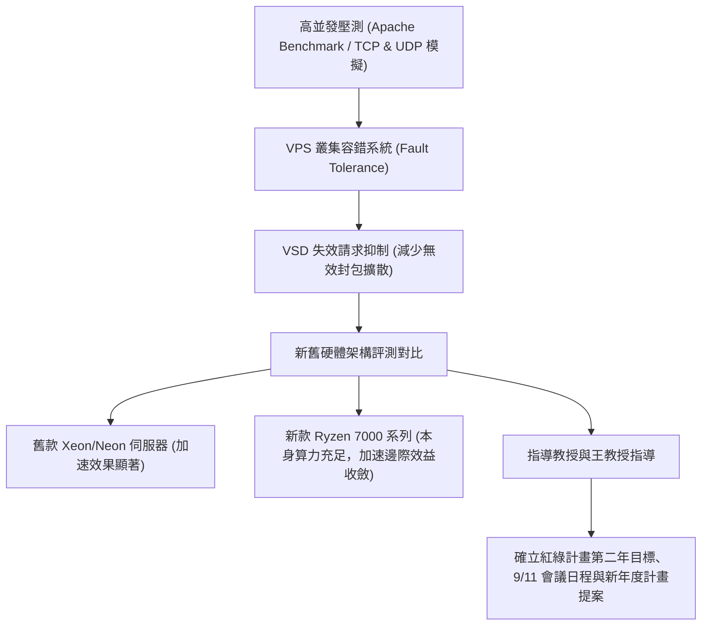

# 🛡️ 20260430-02 實驗室專案會議：跨校整合型計畫（容錯VPS評測、新舊伺服器效能驗證與年度日程）

> **研討主題**：整合型計畫高並發評測（High Concurrency）、VPS 容錯切換、新舊硬體架構加速驗證與年度日程規劃  
> **主講與對談**：發表研究生、計畫主持人／指導教授、王教授  
> **所屬場合**：跨校整合型計畫進度研討會  
> **關聯文件**：[📄 完整原話逐字稿 (20260430-整合型計畫-容錯系統VPS評測與進度研討.full.md)](./20260430-整合型計畫-容錯系統VPS評測與進度研討.full.md)

---

## 🏛️ 核心架構與概念流轉圖

---

## 🔑 重點提要 (Key Takeaways)

1. **高並發環境下的 VPS 容錯**：以 Apache Benchmark 模擬海量並發請求，結合 VSD 機制主動攔截與丟棄已過期或失效的請求，防止容錯切換時引發雪崩效應。
2. **硬體架構對優化演算法之敏感度**：
   - 整合錦城與凱捷的方法進行驗證：在 2015 舊款 Xeon 伺服器上具備顯著加速提升。
   - 在新架構（AMD Ryzen 7000 系列）上，因原生 CPU 運算與記憶體吞吐大幅強化，優化演算法帶來的相對邊際提升趨緩。
3. **整合型計畫年度日程推進**：確認「紅綠計畫第二年」進度匯報節點、9/11 跨校研討日程，以及年底前新年度計畫書架構之預備工作。
