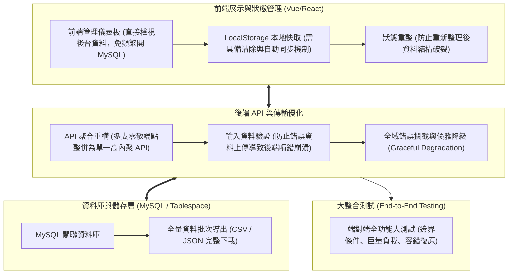

# 💻 LAB-MEET-05-FRONTEND-DB-API-TESTING 整合型研究計畫：前端介面與後端資料庫整合、API 異常處理與全面整合測試研討

> **研討主題**：整合型研究計畫平台全端架構整合、前端直讀資料庫、API 聚合優化、快取容錯與端對端大測試  
> **主持教授**：實驗室指導教授 / 計畫主持人  
> **核心模組**：Frontend-Backend Integration, MySQL Tablespace, API Consolidation, Error Boundary, E2E Testing  
> **學習目標**：掌握大型全端專案除錯策略、解決客戶端快取不同步痛點與建立健全系統容錯邊界  
> **關聯文件**：[📄 完整原話逐字稿 (20260617-平台前端資料庫整合與API錯誤處理測試研討.full.md)](./20260617-平台前端資料庫整合與API錯誤處理測試研討.full.md)

---

## 🏛️ 整合型計畫平台全端架構與錯誤防禦體系

---

## 🎯 核心重點整理 (Key Takeaways)

### 1. 前端可視化管理與 LocalStorage 生命週期
- **前端直接查詢取代原始資料庫客戶端**：透過客製化前端資料表格（Data Table）即時映射資料庫狀態，大幅減少開發者反覆切換 MySQL Workbench / phpMyAdmin 之時間成本。
- **快取一致性與例外重整**：清空 `localStorage` 後系統若出現結構性報錯，暴露出程式碼過度依賴本地未驗證快取；必須加入防禦性預設值（Defensive Default State）與狀態重新整理（Re-hydration）驗證機制。

### 2. API 聚合與輸入邊界容錯
- **端點合併（API Consolidation）**：將兩支時序相依、高度耦合之請求合併為單一複合 API，減少網路延遲（Round-Trip Time）並確保資料交易的一致性（Atomicity）。
- **嚴密之錯誤邊界（Error Boundary）**：當使用者上傳規格不合之錯誤資料時，後端必須精準回傳結構化錯誤代碼（如 HTTP 422），禁止直接拋出未捕捉例外導致整個前端 DOM 結構損壞。

### 3. 全系統端對端（E2E）大測試規劃
- **測試負責人與情境矩陣**：在專案發表前排定專門整合測試階段，由專責組員模擬惡意輸入、網路瞬斷、巨量批次下載等多維度極限情境，確保正式展示之穩定度。
