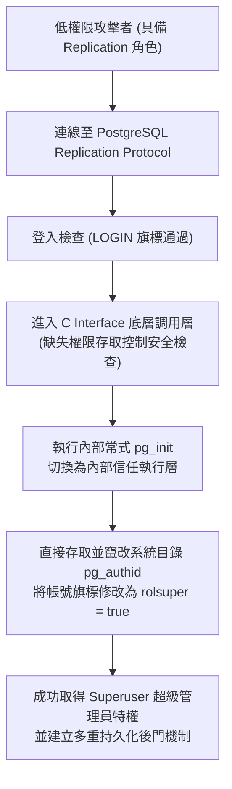
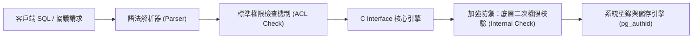

# 🛡️ LAB-NEWS-20260914 實驗室資安新聞研討：PostgreSQL 抄寫協議認證繞過與特權提升漏洞解析

> **研討主題**：PostgreSQL 歷史漏洞成因剖析、Replication 複寫協議認證缺陷、C Interface 權限檢查缺失與提權利用鏈  
> **報告成員**：報告學員、指導教授與實驗室全體成員  
> **核心模組**：PostgreSQL Replication, pg_authid, Privilege Escalation, C Interface Security, Persistence  
> **研討目標**：理解資料庫複寫協議之底層實作盲點，掌握提權攻擊者如何竄改系統型錄維持 Superuser 特權並提出防範方案  
> **關聯文件**：[📄 完整原話逐字稿 (20260914-PostgreSQL複寫協議提權漏洞.full.md)](./20260914-PostgreSQL複寫協議提權漏洞.full.md)

---

## 🏛️ PostgreSQL 複寫協議提權攻擊利用鏈

---

## 🛡️ 資料庫權限檢查深度防禦模型

---

## 🎯 核心重點整理 (Key Takeaways)

### 1. 漏洞成因與歷史背景
- **潛伏十二年歷史缺陷**：PostgreSQL 為了支援主從庫同步、異地備份與 CDC（Change Data Capture）資料流，提供了一組 Replication 協議。
- **安全檢查繞過**：正常使用者透過 SQL 查詢時會受到嚴格的存取控制列表（ACL）檢查；但當使用帶有 Replication 屬性的帳號連線並通過 LOGIN 旗標驗證後，請求進入 C Interface 底層層級，缺乏後續操作權限檢查。

### 2. 提權至 Superuser 的攻擊鏈
- **`pg_init` 內部切換**：攻擊者利用複寫協議介面執行初始化常式，將進程權限 context 切換至內部信任層。
- **竄改 `pg_authid`**：直接修改記錄資料庫使用者身份與權限的系統型錄 `pg_authid`，將攻擊者帳號標記為 `rolsuper = true`，完成縱向權限提升（Vertical Privilege Escalation）。
- **持久化維護**：攻擊者通常會佈署多種後門持久化機制，即便管理員事後修復部分設定，仍可持續保有超級使用者存取。
