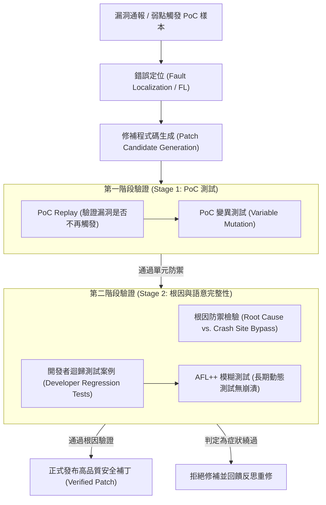
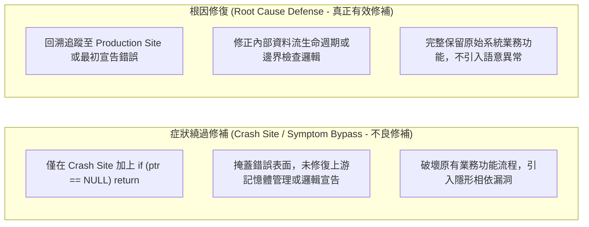

# 🛡️ MASTER-APR-01-VULN-REPAIR 碩士專題討論：自動化程式漏洞修復（APR）之兩階段根因分析與修補有效性驗證

> **研討主題**：自動化程式修復（APR: Automated Program Repair）、漏洞根因分析（Root Cause Analysis）、兩階段修補驗證與模糊測試整合  
> **研討講者**：發表研究生（系統資安與軟體工程實驗室）  
> **指導教授**：指導教授（陳教授）  
> **核心模組**：Automated Program Repair (APR), Fault Localization, Root Cause vs Crash Site, Two-Stage Patch Validation, AFL++ Fuzzing, PoC Replay  
> **研討目標**：深入剖析軟體弱點自動修復之兩階段驗證架構，釐清症狀規避修補與真正根因防禦之本質差異，並掌握結合 AFL++ 與開發者用例之修補品質評估法  
> **關聯文件**：[📄 完整原話逐字稿 (2026-09-14-自動化漏洞修復APR根因分析與兩階段驗證-proofread.md)](./2026-09-14-自動化漏洞修復APR根因分析與兩階段驗證-proofread.md)

---

## 🏛️ 自動化程式修復 (APR) 兩階段驗證架構

---

## 📊 修補品質本質差異：根因修復 vs. 崩潰點規避

---

## 🎯 核心重點整理 (Key Takeaways)

### 1. 自動化程式修復 (APR) 之「過度擬合」難題與症狀規避
- **修補過擬合（Patch Overfitting）**：許多 APR 工具為了快速通過弱點測試案例，傾向於直接在崩潰點（Crash Site）加入簡單的跳過判斷（如 `if (!ptr) return;`）。雖然該 PoC 不再觸發系統崩潰，但程式本質上的業務邏輯已遭破壞，並未真正根除威脅。
- **兩階段驗證必要性**：第一階段利用 PoC 及其變異測試進行輕量快速過濾；第二階段必須透過人機協同審查與迴歸測試，確保修補發生於根因節點（Root Cause Node），而非單純繞過崩潰點。

### 2. 弱點修補有效性之多維度評估管線
- **動態輕量化定位**：面對代碼庫龐大、符號執行易崩潰之困境，採用輕量動態追蹤配合堆疊回溯（Call Stack Traceback），聚焦潛在錯誤函式範圍（Function of Interest, FOI）。
- **AFL++ 模糊測試整合**：修補生成後，除了重放原始 PoC，進一步將修補程式送入 AFL++ 進行長時間動態模糊測試（Fuzzing），驗證邊界值與記憶體安全性，防範修補衍生新 0-day 弱點。

### 3. 指導教授學術評析與研究深化建議
- **陳教授指導重點**：學術研究應跳脫單一企業 Case 的表面探討，應將修補案例抽象化為通用的「多模態/多層次架構模型（Multimodal / Multi-faceted Model）」。
- **對比基準與多語言適應性**：對比 Repair、PatchAgent、Codex 等基準架構，深入分析其在 C/C++ 記憶體安全與其他高階語言中之移植難度與泛化能力，形成具備高度說服力的碩士研究成果。
